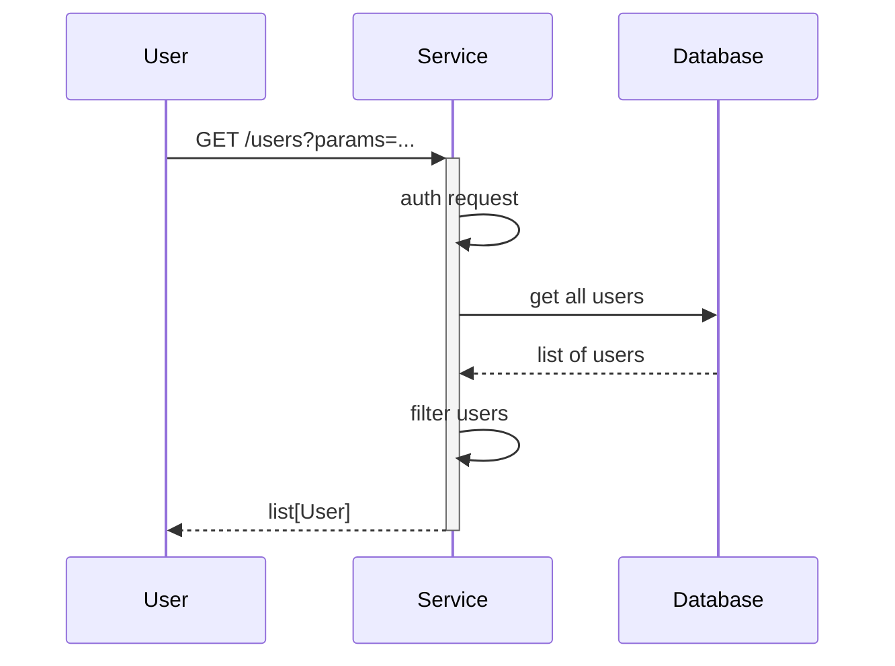

# Find the right service

[](https://github.com/nhs-england-tools/repository-template/actions/workflows/cicd-1-pull-request.yaml)
[](https://sonarcloud.io/summary/new_code?id=repository-template)

The primary purpose of the find the right service (FTRS) is to help direct patients to the NHS service that is most appropriate for their urgent care

The system is commissioned, developed and hosted by NHS England

The service consists of a number of key components

- a directory of services

## The Directory of Services (DOS)

The DOS holds data for Urgent and Emergency, Primary, Secondary and Tertiary Sector care services. The data held for each service relates to its location, availability and treatment/care
provided

## Data sourcing

Currently supported technologies are:

- Terraform
- Docker
- Podman

Make use of this repository template to expedite your project setup and enhance your productivity right from the get-go. Enjoy the advantage of having a well-structured, self-documented project that reduces overhead and increases focus on what truly matters - coding!

## Table of Contents

- [Find the right service](#find-the-right-service)
  - [The Directory of Services (DOS)](#the-directory-of-services-dos)
  - [Data sourcing](#data-sourcing)
  - [Table of Contents](#table-of-contents)
  - [Setup](#setup)
    - [Prerequisites](#prerequisites)
    - [Configuration](#configuration)
  - [Usage](#usage)
    - [Testing](#testing)
  - [Design](#design)
    - [Diagrams](#diagrams)
    - [Modularity](#modularity)
  - [Contributing](#contributing)
    - [Branch naming convention](#branch-naming-convention)
    - [Commit message convention](#commit-message-convention)
  - [Contacts](#contacts)
  - [Licence](#licence)

## Setup

By including preferably a one-liner or if necessary a set of clear CLI instructions we improve user experience. This should be a frictionless installation process that works on various operating systems (macOS, Linux, Windows WSL) and handles all the dependencies.

Clone the repository

```shell
git clone https://github.com/nhs-england-tools/repository-template.git
cd nhs-england-tools/repository-template
```

### Prerequisites

The following software packages, or their equivalents, are expected to be installed and configured:

- [Docker](https://www.docker.com/) container runtime or a compatible tool, e.g. [Podman](https://podman.io/),
- [asdf](https://asdf-vm.com/) version manager,
- [GNU make](https://www.gnu.org/software/make/) 3.82 or later,

> [!NOTE]<br>
> The version of GNU make available by default on macOS is earlier than 3.82. You will need to upgrade it or certain `make` tasks will fail. On macOS, you will need [Homebrew](https://brew.sh/) installed, then to install `make`, like so:
>
> ```shell
> brew install make
> ```
>
> You will then see instructions to fix your [`$PATH`](https://github.com/nhs-england-tools/dotfiles/blob/main/dot_path.tmpl) variable to make the newly installed version available. If you are using [dotfiles](https://github.com/nhs-england-tools/dotfiles), this is all done for you.

- [GNU sed](https://www.gnu.org/software/sed/) and [GNU grep](https://www.gnu.org/software/grep/) are required for the scripted command-line output processing,
- [GNU coreutils](https://www.gnu.org/software/coreutils/) and [GNU binutils](https://www.gnu.org/software/binutils/) may be required to build dependencies like Python, which may need to be compiled during installation,

> [!NOTE]<br>
> For macOS users, installation of the GNU toolchain has been scripted and automated as part of the `dotfiles` project. Please see this [script](https://github.com/nhs-england-tools/dotfiles/blob/main/assets/20-install-base-packages.macos.sh) for details.

- [Python](https://www.python.org/) required to run Git hooks,
- [`jq`](https://jqlang.github.io/jq/) a lightweight and flexible command-line JSON processor.

### Configuration

Installation and configuration of the toolchain dependencies

```shell
make config
```

## Usage

After a successful installation, provide an informative example of how this project can be used. Additional code snippets, screenshots and demos work well in this space. You may also link to the other documentation resources, e.g. the [User Guide](./docs/user-guide.md) to demonstrate more use cases and to show more features.

### Testing

There are `make` tasks for you to configure to run your tests.  Run `make test` to see how they work.  You should be able to use the same entry points for local development as in your CI pipeline.

## Design

### Diagrams

The [C4 model](https://c4model.com/) is a simple and intuitive way to create software architecture diagrams that are clear, consistent, scalable and most importantly collaborative. This should result in documenting all the system interfaces, external dependencies and integration points.


The source for diagrams should be in Git for change control and review purposes. Recommendations are [draw.io](https://app.diagrams.net/) (example above in [docs](.docs/diagrams/) folder) and [Mermaids](https://github.com/mermaid-js/mermaid). Here is an example Mermaids sequence diagram:



### Modularity

Most of the projects are built with customisability and extendability in mind. At a minimum, this can be achieved by implementing service level configuration options and settings. The intention of this section is to show how this can be used. If the system processes data, you could mention here for example how the input is prepared for testing - anonymised, synthetic or live data.

## Contributing

Describe or link templates on how to raise an issue, feature request or make a contribution to the codebase. Reference the other documentation files, like

- Environment setup for contribution, i.e. `CONTRIBUTING.md`
- Coding standards, branching, linting, practices for development and testing
- Release process, versioning, changelog
- Backlog, board, roadmap, ways of working
- High-level requirements, guiding principles, decision records, etc.

### Branch naming convention

A valid branch name is made up of these elements - in this order

- branch type - must be one of task, hotfix
- jira ref    - the unique identifier of the Jira ticket prompting the change
- separator   - either a hyphen or an underscore
- description - Must start with an alphanumeric and contain only alphanumerics/hyphens/underscores with a min length of 10 characters and a max length of 45

Examples of valid branch names

- task/XXX-123_My_valid_branch_name - words of description separated by underscores
- task/XXX-123-My-valid-branch-name - words of description separated by hyphens
- task/XXX-123_MyValidBranchName    - camelcase description
- task/XXX-123-My-valid_branch_name - description with mix of underscores and hyphens

Examples of invalid branch names

- XXX-123_My_Invalid_branch_name  - does not start with branch type of ie - task or hotfix
- task/MyInvalidbranchName        - does not include JIRA reference
- task/XXX-123MyInvalidBranchName - no separator after JIRA reference

### Commit message convention

A valid commit message must

- start with a valid Jira reference (to aid traceability of changes eg when building a release) and
- consist of at least three words (to prompt a meaningful description of the commit)
- not exceed 100 characters (encouraging concise wording for readability essentially)

If the contributor does not include the JIRA reference a githook will insert it at the start of the message, deriving it from the branch name

## Contacts

Provide a way to contact the owners of this project. It can be a team, an individual or information on the means of getting in touch via active communication channels, e.g. opening a GitHub discussion, raising an issue, etc.

## Licence

> The [LICENCE.md](./LICENCE.md) file will need to be updated with the correct year and owner

Unless stated otherwise, the codebase is released under the MIT License. This covers both the codebase and any sample code in the documentation.

Any HTML or Markdown documentation is [© Crown Copyright](https://www.nationalarchives.gov.uk/information-management/re-using-public-sector-information/uk-government-licensing-framework/crown-copyright/) and available under the terms of the [Open Government Licence v3.0](https://www.nationalarchives.gov.uk/doc/open-government-licence/version/3/).
